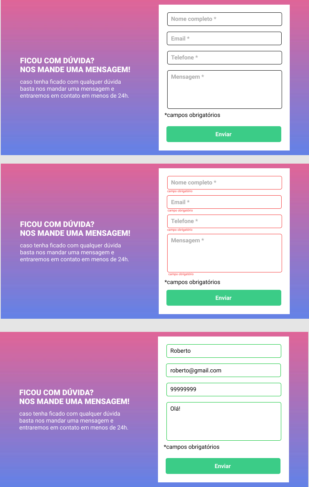

# Evento de Formulário
Projeto com evento de formulário change, assim para que sua interface responda rapidamente o evento de toque foi adicionado como parâmetro a um listener🧐

   []

## Tecnologias utilizadas
- HTML
- CSS
- JavaScript
